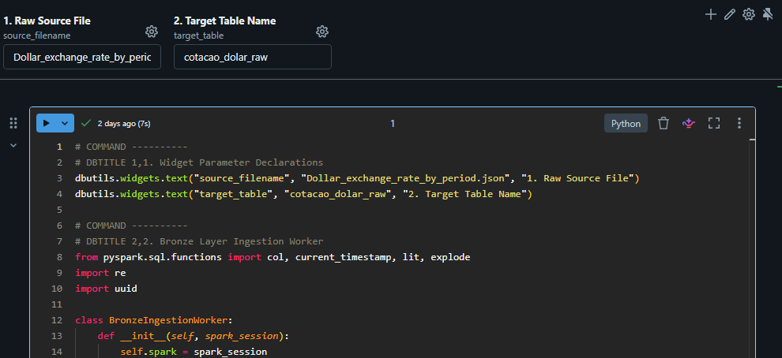

# Pipeline and Dashboard for Currency Volatility Analysis (PTAX Dollar) via Medallion Architecture

This repository contains the development of an end-to-end analytical data solution. The project ingests raw and nested data from the official quotation API of the Central Bank of Brazil, processes and governs the pipeline in a Big Data environment via **Databricks (Apache Spark)** using the **Medallion Architecture**, and makes the final layer available for executive consumption in an optimized dashboard in **Power BI Desktop**.

---

## 🏗️ Lakehouse Architecture and Dimensional Model

### Data Pipeline (Medallion)

[Central Bank API] ──> [Bronze: Raw JSON] ──> [Silver: Clean & Cast] ──> [Gold: Window Functions] ──> [Power BI (Star Schema)]

Data Modeling in Power BI (Star Schema)
The relationship between the tables was designed in an optimized way to ensure high performance in temporal queries, applying a secure many-to-one relationship without duplicates:

[dim_calendar]                  [fact_exchange_rate]
  reference_date (1) ────────── (*) reference_date
  year                              buy_rate
  month                             sell_rate
  month_name                        exchange_spread
  weekday                           dod_variation_pct
                                    market_status

🛠️ Step-by-Step Technical-Operational Implementation
Part 1 — Data Engineering (Databricks / PySpark / Spark SQL)
1. Ingestion and Standardization (Bronze Layer)
Source: Reading raw and nested JSON files stored in the Lakehouse storage layer at /Volumes/dollar_exchange_rate/bronze/dados.

Normalization: Using PySpark with regular expressions (Regex) to scan the schema and dynamically convert the original column pattern from camelCase to snake_case.

2. Cleansing and Enrichment (Silver Layer)
Strong Typing: Rigorous conversion and handling of timestamp strings containing millisecond variations to the native TimestampType type.

Business Rule: Generation of the currency_spread metric (sell_rate - buy_rate).

Resilience: Implementation of try/except control blocks to save tables in Delta format and generation of structured logs for pipeline auditing.

3. Elimination of Duplicates and Historical Metrics (Gold Layer)
To mitigate the granularity problem caused by multiple intraday bulletins issued by the API, Window Functions were applied in Spark SQL:

ROW_NUMBER(): Partitioned by date and ordered by timestamp in descending order to strictly filter the last official quote (closing) of each business day.

LAG(): Executed directly on the distributed Spark engine to capture the previous day's quote and natively calculate the daily percentage variation (dod_variation_pct), relieving the Power BI processing load.

Part 2 — Analytical Layer and Visualization (Power BI Desktop)

4. Connection and Loading (Power Query)
Connection established via Spark SQL Endpoint directly with the active Databricks cluster.

Conversion of the reference_date field from Text to Date format.

Creation of a chronological control column based on the month index for sorting.

5. Development of the Metrics Layer (DAX)
Creation of explicit measures in the fact table, configured and formatted strictly to 4 decimal places to maintain compliance with PTAX exchange rate rules:
Last Quote = LASTNONBLANK(fact_exchange_rate[sell_rate], 1)

Maximum Peak = MAX(fact_exchange_rate[sell_rate])

Average Spread = AVERAGE(fact_exchange_rate[exchange_spread])

Market Status = IF(AVERAGE(fact_exchange_rate[exchange_spread]) > 0, "HIGH VOLATILITY", "STABLE")

DoD Percentage = AVERAGE(fact_exchange_rate[dod_variation_pct]) * 100

Daily Rate = AVERAGE(fact_exchange_rate[sell_rate])

6. Visual Cleanup and Weekday Filter
Applying a page-level filter based on the weekday column generated in the calendar dimension.

Complete elimination of records corresponding to Saturdays and Sundays to remove empty gaps and visual noise from audit charts and tables.

7. Interface Design (Executive UI/UX)
Visual Identity: Configuration of a high-contrast layout (Dark Mode) using the color #1E1E1E for the page background (0% transparency) and #252540 as the background for cards and chart containers.

Area Chart (Historical Trend): Plotting of the Daily Rate by reference_date with automatic date hierarchy removal, allowing the neon green line (#4ECCA3) to oscillate with surgical precision day by day.

Waterfall Chart (Monthly DoD): Display of the aggregate percentage change per month, with ascending chronological order and color highlighting for alerts (Increase: #4ECCA3 / Decrease: #E05050).

Volatility Table: Lower right panel acting as a detailed risk audit grid to list final dates, spreads, and rates.

